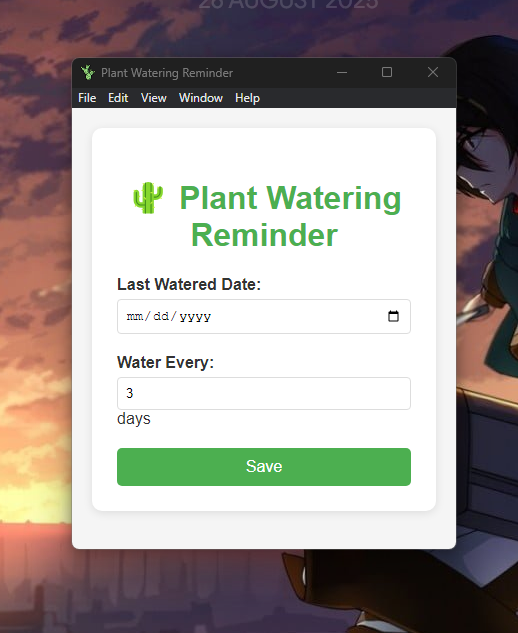

# 🌱 Plant Watering Reminder

<div align="center">
  
  
  
  
  
  
  
</div>

<div align="center">
  <p><em>Never let your green friends go thirsty again! 💚</em></p>
</div>

## 📸 Screenshots

<div align="center">
  
  <p><em>Clean and intuitive home interface</em></p>
</div>

<div align="center">
  
  <p><em>Friendly reminder notifications</em></p>
</div>

---

## 📖 About

**Plant Watering Reminder** is a friendly desktop application designed to help plant parents keep their leafy companions happy and hydrated. Running quietly in your system tray, it sends gentle reminders when it's time to water your plants, ensuring they never go thirsty while you're busy with life.

### ✨ Key Features

- 🗓️ **Smart Scheduling** - Set custom watering intervals for each plant
- 🔔 **Desktop Notifications** - Friendly reminders that won't let you forget
- 💾 **Persistent Storage** - Your settings are saved automatically
- 🚀 **Auto-Launch** - Starts with your computer, so you're always covered
- 🎯 **System Tray Integration** - Stays out of your way but always accessible
- 📱 **User-Friendly Interface** - Simple, clean, and easy to use

---

## 🚀 Getting Started

### Prerequisites

Before you begin, make sure you have these installed:

- **Node.js** (version 12.0.0 or later) - [Download here](https://nodejs.org/)
- **npm** (comes with Node.js)

### 📦 Installation

1. **Clone the repository**
   ```bash
   git clone https://github.com/yourusername/plant-watering-reminder.git
   ```

2. **Navigate to the project directory**
   ```bash
   cd plant-watering-reminder
   ```

3. **Install dependencies**
   ```bash
   npm install
   ```

4. **Start the application**
   ```bash
   npm start
   ```

5. **Build installer (optional)**
   ```bash
   npm run dist
   ```
   This creates a `.exe` installer in the `dist` folder for easy installation.

---

## 🌿 How to Use

### Setting Up Your First Plant

1. **Launch the app** - It will appear in your system tray
2. **Set the last watered date** - When did you last water your plant?
3. **Choose watering interval** - How many days between waterings?
4. **Save and relax** - The app handles the rest!

### Example Workflow

```
🌱 Last Watered: August 19, 2025
⏰ Interval: 3 days
📅 Next Reminder: August 22, 2025
```

When it's time to water, you'll see a friendly notification. Click it to mark your plant as watered and reset the timer!

### ⚡ Pro Tips

- The app checks every hour for watering reminders
- Click the notification window to quickly mark as watered
- Your settings persist between app restarts
- The app runs quietly in the background

---

## 🛠️ Built With

| Technology | Purpose |
|------------|---------|
| **Electron.js** | Cross-platform desktop app framework |
| **Node.js** | Backend logic and file operations |
| **JavaScript** | Core application logic |
| **HTML/CSS** | User interface design |
| **Auto-launch** | System startup integration |
| **Node.js fs** | Local data persistence |

---

## 🤝 Contributing

We'd love your help making Plant Watering Reminder even better! Here's how to get involved:

### How to Contribute

1. **Fork** the repository
2. **Create** a feature branch
   ```bash
   git checkout -b feature/amazing-new-feature
   ```
3. **Make** your changes
4. **Commit** with a clear message
   ```bash
   git commit -m 'Add amazing new feature'
   ```
5. **Push** to your branch
   ```bash
   git push origin feature/amazing-new-feature
   ```
6. **Open** a Pull Request


## 🐛 Known Issues

We're aware of these issues and working on fixes:

| Issue | Description | Status |
|-------|-------------|---------|
| 🖥️ **Off-screen notifications** | Reminder window may appear off-screen on some resolutions | 🔧 In Progress |
| 📅 **Leap year handling** | Interval calculations don't account for February 29th | 📋 Planned |

Found a bug? Please [open an issue](https://github.com/yourusername/plant-watering-reminder/issues) with details!

---

## 📞 Get in Touch

- 🐛 **Report Bugs**: [GitHub Issues](https://github.com/TechySakib/plant-watering-reminder/issues)
- 💡 **Feature Requests**: [GitHub Discussions](https://github.com/TechySakib/plant-watering-reminder/discussions)
- 📧 **Contact**: your.email@example.com

---


<div align="center">
  <p>Made with 💚 for plant lovers everywhere</p>
  <p><em>Happy Growing! 🌱</em></p>
</div>
